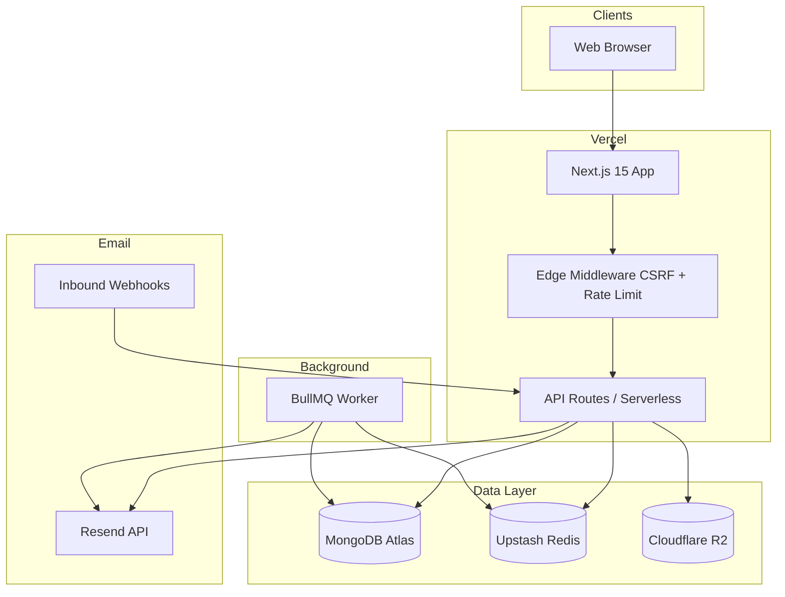

# Zyoris Mail — Production Readiness Report

**Date:** 2026-06-05  
**Verdict:** Application is **build-ready and deployed** to Vercel. Full SaaS operation requires completing cloud credentials and DNS (documented below).

## Summary

| Area | Status |
|------|--------|
| Code completeness | ✅ No placeholder pages; mail client + admin + org UI implemented |
| Security baseline | ✅ CSRF, webhook signatures, RBAC, fake DNS route removed |
| Tests | ✅ 10/10 Vitest unit tests |
| Build | ✅ Local + Vercel production build |
| Deploy | ✅ https://zyoris-mail.vercel.app |
| Custom domain | ⚠️ `mail.zyoris.com` / `zyoris.com` added in Vercel; DNS pending in Cloudflare |
| Database | ⚠️ Placeholder `MONGODB_URI` on Vercel — replace with Atlas |
| Email delivery | ⚠️ Requires Resend keys + domain verification |
| Worker | ⚠️ BullMQ worker must run off-Vercel |

## Architecture

## Admin setup

1. Set real `MONGODB_URI` in Vercel.
2. Redeploy or wait for env refresh.
3. Locally: `MONGODB_URI=... npm run seed:admin`
4. Sign in at `/login` with `SUPER_ADMIN_EMAIL` / `SUPER_ADMIN_PASSWORD`.
5. Change password via your security process (reset flow or DB update).

## Smoke test checklist

- [ ] `GET /api/health` returns `ok: true`
- [ ] Signup → OTP → login
- [ ] Add domain → verify DNS records
- [ ] Create mailbox → send email
- [ ] Inbound webhook delivers to inbox
- [ ] Attachment upload + download
- [ ] Admin dashboard loads for SUPER_ADMIN only

## Known limitations

- Billing switches plans in DB only (no Stripe).
- Scheduled email requires Redis + worker process.
- Vercel serverless has execution time limits for large attachments.

## Recommended production URLs

| Purpose | URL |
|---------|-----|
| Mail app (primary) | https://mail.zyoris.com |
| Vercel default | https://zyoris-mail.vercel.app |
| Marketing | https://www.zyoris.com |
